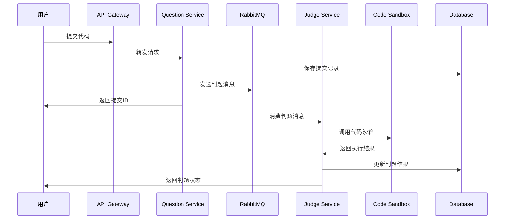

# ZOJ 在线判题系统 - 微服务版本

## 📖 项目简介

ZOJ (Zhejiang Online Judge) 是一个基于 Spring Cloud 微服务架构的在线判题系统，支持多种编程语言的代码提交、编译、执行和判题功能。

### 🎯 核心功能

- **用户管理**: 用户注册、登录、权限管理
- **题目管理**: 题目的增删改查、分类管理
- **代码提交**: 支持多种编程语言的代码提交
- **在线判题**: 实时代码执行和结果判定
- **Docker 沙箱**: 安全的代码执行环境
- **消息队列**: 异步判题处理，提升系统性能

### 🏗️ 技术架构

```
┌─────────────────┐    ┌─────────────────┐    ┌─────────────────┐
│   前端 (Vue3)   │────│  API Gateway   │────│  用户服务       │
└─────────────────┘    │  (Spring Cloud) │    │  (User Service) │
                       └─────────────────┘    └─────────────────┘
                              │                        │
                       ┌─────────────────┐    ┌─────────────────┐
                       │  题目服务       │    │  判题服务       │
                       │ (Question Svc)  │    │ (Judge Service) │
                       └─────────────────┘    └─────────────────┘
                              │                        │
                       ┌─────────────────┐    ┌─────────────────┐
                       │   RabbitMQ      │    │  Docker 沙箱    │
                       │  (消息队列)     │    │ (Code Sandbox)  │
                       └─────────────────┘    └─────────────────┘
                              │                        │
                       ┌─────────────────┐    ┌─────────────────┐
                       │   MySQL         │    │   Redis         │
                       │  (数据存储)     │    │  (缓存/会话)    │
                       └─────────────────┘    └─────────────────┘
```

## 🚀 快速开始

### 环境要求

- **Java**: 17+
- **Maven**: 3.6+
- **MySQL**: 8.0+
- **Redis**: 6.0+
- **RabbitMQ**: 3.8+
- **Nacos**: 2.0+
- **Docker**: 20.0+ (用于代码沙箱)

### 1. 克隆项目

```bash
git clone <repository-url>
cd zoj-backend-microservice
```

### 2. 数据库初始化

```sql
-- 创建数据库
CREATE DATABASE zoj CHARACTER SET utf8mb4 COLLATE utf8mb4_unicode_ci;

-- 使用数据库
USE zoj;

-- 执行建表脚本
SOURCE sql/create_table.sql;
```

### 3. 配置修改

修改各服务的配置文件中的数据库、Redis、RabbitMQ、Nacos 连接信息：

- `zoj-backend-gateway/src/main/resources/application.yml`
- `zoj-backend-user-service/src/main/resources/application.yml`
- `zoj-backend-question-service/src/main/resources/application.yml`
- `zoj-backend-judge-service/src/main/resources/application.yml`

### 4. 启动服务

#### 方式一：Maven 启动（开发环境）

```bash
# 1. 启动网关服务
cd zoj-backend-gateway
mvn spring-boot:run

# 2. 启动用户服务
cd ../zoj-backend-user-service
mvn spring-boot:run

# 3. 启动题目服务
cd ../zoj-backend-question-service
mvn spring-boot:run

# 4. 启动判题服务
cd ../zoj-backend-judge-service
mvn spring-boot:run
```

#### 方式二：Docker 启动（生产环境）

```bash
# 构建并启动所有服务
docker-compose up -d
```

## 📁 项目结构

```
zoj-backend-microservice/
├── zoj-backend-common/           # 公共模块
│   ├── src/main/java/
│   │   └── com/zluolan/zojbackendcommon/
│   │       ├── config/          # 配置类
│   │       ├── util/           # 工具类
│   │       └── exception/      # 异常类
│   └── pom.xml
├── zoj-backend-model/           # 数据模型模块
│   ├── src/main/java/
│   │   └── com/zluolan/zojbackendmodel/
│   │       ├── entity/         # 实体类
│   │       ├── dto/           # 数据传输对象
│   │       └── enums/         # 枚举类
│   └── pom.xml
├── zoj-backend-service-client/  # 服务客户端模块
│   ├── src/main/java/
│   │   └── com/zluolan/zojbackendserviceclient/
│   │       └── client/        # Feign 客户端
│   └── pom.xml
├── zoj-backend-gateway/          # API 网关
│   ├── src/main/java/
│   │   └── com/zluolan/zojbackendgateway/
│   │       ├── filter/        # 过滤器
│   │       └── ZojBackendGatewayApplication.java
│   ├── src/main/resources/
│   │   └── application.yml
│   └── pom.xml
├── zoj-backend-user-service/    # 用户服务
│   ├── src/main/java/
│   │   └── com/zluolan/zojbackenduserservice/
│   │       ├── controller/    # 控制器
│   │       ├── service/      # 服务层
│   │       ├── mapper/       # 数据访问层
│   │       └── ZojBackendUserServiceApplication.java
│   ├── src/main/resources/
│   │   └── application.yml
│   └── pom.xml
├── zoj-backend-question-service/ # 题目服务
│   ├── src/main/java/
│   │   └── com/zluolan/zojbackendquestionservice/
│   │       ├── controller/    # 控制器
│   │       ├── service/      # 服务层
│   │       ├── mapper/       # 数据访问层
│   │       └── mq/          # 消息队列
│   ├── src/main/resources/
│   │   └── application.yml
│   └── pom.xml
├── zoj-backend-judge-service/   # 判题服务
│   ├── src/main/java/
│   │   └── com/zluolan/zojbackendjudgeservice/
│   │       ├── controller/   # 控制器
│   │       ├── service/     # 服务层
│   │       ├── mq/          # 消息队列
│   │       └── utils/       # 工具类
│   ├── src/main/resources/
│   │   └── application.yml
│   └── pom.xml
├── docker-compose.yml           # Docker 编排文件
├── Dockerfile.*                # 各服务 Dockerfile
└── pom.xml                     # 父级 POM 文件
```

## 🔧 服务端口

| 服务名称 | 端口 | 描述 |
|---------|------|------|
| API Gateway | 8100 | 统一入口，路由转发 |
| User Service | 8101 | 用户管理服务 |
| Question Service | 8102 | 题目管理服务 |
| Judge Service | 8103 | 判题服务 |
| Code Sandbox | 8080 | Docker 代码沙箱 |

## 🔐 认证授权

系统使用 JWT (JSON Web Token) 进行用户认证：

- **Token 生成**: 用户登录成功后生成 JWT Token
- **Token 验证**: API Gateway 统一验证 Token
- **权限控制**: 基于角色的访问控制 (RBAC)

## 📊 数据流程

### 代码提交与判题流程



## 🐳 Docker 部署

### 1. 构建镜像

```bash
# 构建所有服务镜像
docker build -t zoj-gateway:latest -f Dockerfile.gateway .
docker build -t zoj-user-service:latest -f Dockerfile.user-service .
docker build -t zoj-question-service:latest -f Dockerfile.question-service .
docker build -t zoj-judge-service:latest -f Dockerfile.judge-service .
```

### 2. 使用 Docker Compose

```bash
# 启动所有服务
docker-compose up -d

# 查看服务状态
docker-compose ps

# 查看日志
docker-compose logs -f

# 停止服务
docker-compose down
```

## 🔍 API 文档

启动服务后，可通过以下地址访问 API 文档：

- **网关聚合文档**: http://localhost:8100/doc.html
- **用户服务文档**: http://localhost:8101/doc.html
- **题目服务文档**: http://localhost:8102/doc.html
- **判题服务文档**: http://localhost:8103/doc.html

## 🛠️ 开发指南

### 添加新服务

1. 在根目录 `pom.xml` 中添加模块
2. 创建服务目录和 `pom.xml`
3. 实现服务代码
4. 在网关中配置路由
5. 更新 Docker 配置

### 数据库迁移

1. 修改实体类
2. 更新 Mapper XML
3. 执行数据库脚本
4. 测试数据一致性

### 消息队列使用

```java
// 发送消息
@Autowired
private MyMessageProducer messageProducer;

public void sendJudgeMessage(Long questionSubmitId) {
    messageProducer.sendMessage(String.valueOf(questionSubmitId));
}

// 消费消息
@RabbitListener(queues = "code_queue")
public void receiveMessage(String message) {
    // 处理判题逻辑
}
```

## 🐛 故障排除

### 常见问题

1. **服务启动失败**
   - 检查端口是否被占用
   - 验证数据库连接配置
   - 确认 Nacos 服务可用

2. **JWT 认证失败**
   - 检查 Token 是否过期
   - 验证 JWT 密钥配置
   - 确认网关过滤器配置

3. **判题服务异常**
   - 检查 Docker 沙箱状态
   - 验证 RabbitMQ 连接
   - 查看判题服务日志

4. **数据库连接问题**
   - 检查数据库服务状态
   - 验证连接字符串
   - 确认用户权限

### 日志查看

```bash
# 查看特定服务日志
docker-compose logs -f zoj-gateway
docker-compose logs -f zoj-user-service
docker-compose logs -f zoj-question-service
docker-compose logs -f zoj-judge-service
```

## 📈 性能优化

### 建议配置

1. **JVM 参数调优**
   ```bash
   -Xms512m -Xmx1024m -XX:+UseG1GC
   ```

2. **数据库连接池**
   ```yaml
   spring:
     datasource:
       hikari:
         maximum-pool-size: 20
         minimum-idle: 5
   ```

3. **Redis 缓存策略**
   - 用户会话缓存
   - 题目信息缓存
   - 判题结果缓存

## 🤝 贡献指南

1. Fork 项目
2. 创建特性分支 (`git checkout -b feature/AmazingFeature`)
3. 提交更改 (`git commit -m 'Add some AmazingFeature'`)
4. 推送到分支 (`git push origin feature/AmazingFeature`)
5. 打开 Pull Request

## 📄 许可证

本项目采用 MIT 许可证 - 查看 [LICENSE](LICENSE) 文件了解详情。

## 📞 联系方式

- **项目维护者**: zluolan
- **邮箱**: [your-email@example.com]
- **GitHub**: [your-github-profile]

---

## 🙏 致谢

感谢所有为这个项目做出贡献的开发者和开源社区！

## 📝 更新日志

### v1.0.0 (2025-09-28)
- ✨ 初始版本发布
- 🚀 完整的微服务架构
- 🔐 JWT 认证系统
- 🐳 Docker 代码沙箱集成
- 📊 RabbitMQ 异步判题
- 📚 完整的 API 文档
